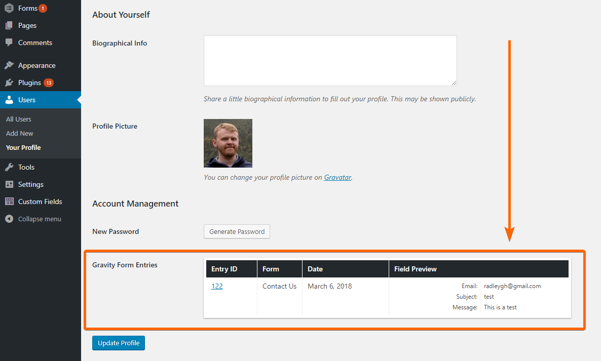

RS Gravity Forms - User Entries On Profile (WordPress Plugin)
==

_Displays form entries submitted by a user on their profile. Accessible only to administrators and anyone with the "gravityforms_view_entries" role._

    Contributors: radgh
    Donate link: https://paypal.me/radgh
    Tags: gravityforms, users
    Requires at least: 3.2
    Tested up to: 4.9.8
    Stable tag: 1.0.3
    License: GPLv3
    License URI: http://www.gnu.org/licenses/gpl-3.0.txt

## Description ##

This plugin allows you to see a table of entries that have been submitted by the user whose profile you are viewing in the dashboard.

For entries to appear, the user must have been signed in when they submitted the form, or have had their account created (via Gravity Form User Registration Addon). Entries that were submitted as a guest (not logged in) will not appear.

## Installation ##

1. Upload the plugin files to `/wp-content/plugins/rs-gravityforms-user-entries-on-profile/`, or install the plugin through the WordPress plugins screen.
1. Activate the plugin through the 'Plugins' screen in WordPress
1. Edit a user's profile and locate the "Gravity Form Entries" field that will be listed below the "Generate Password" button.

## Frequently Asked Questions ##

None yet.

## Screenshots ##

## Changelog ##

#### 1.0
* First release

## Upgrade Notice ##

None yet.